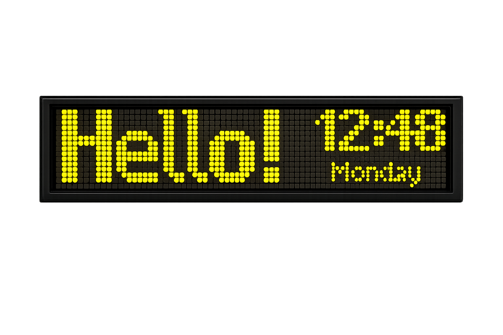
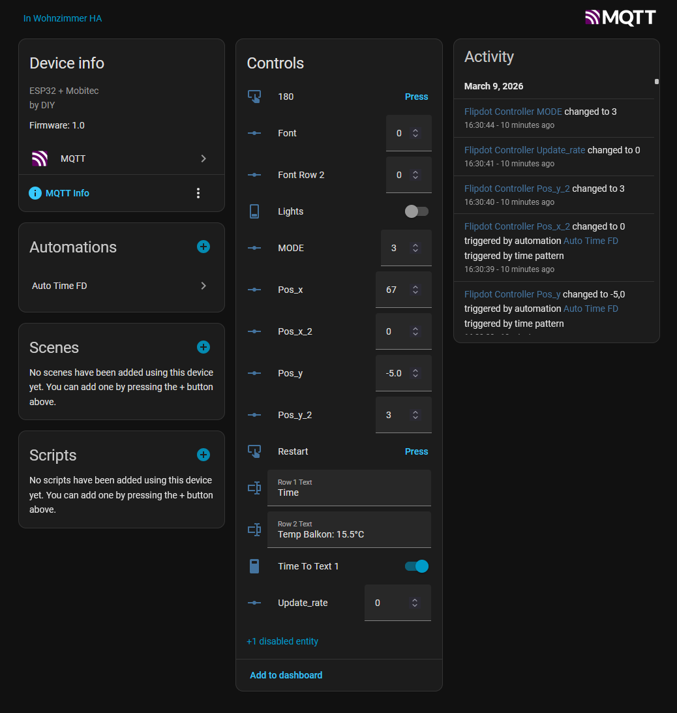
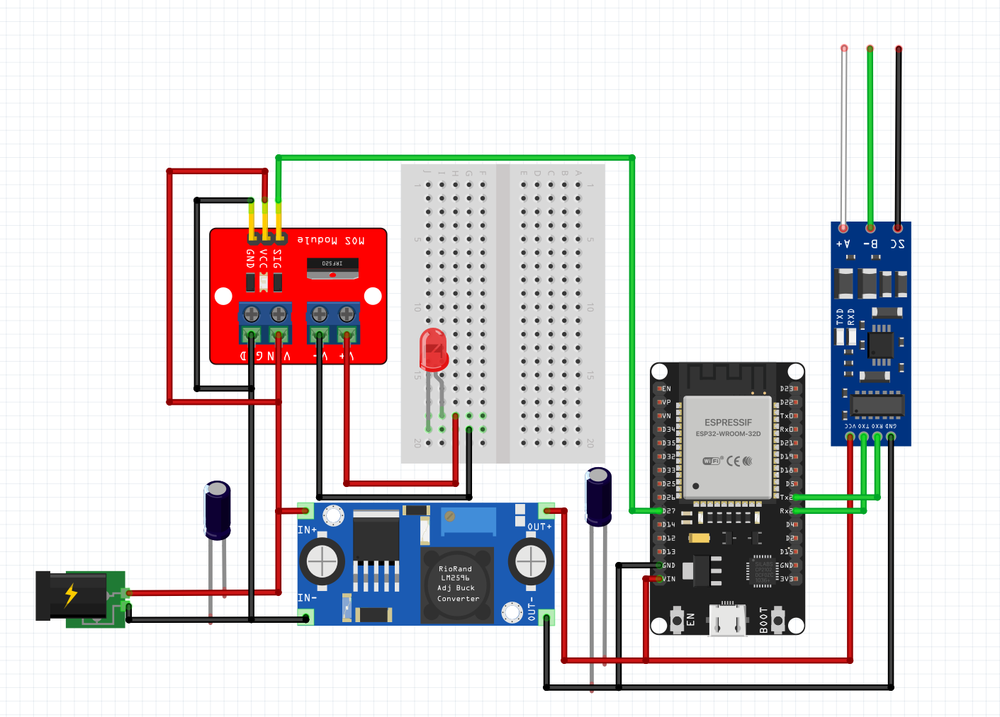

<h1 align="center"><b>FlipDot_ESP_MQTT</b></h1>
Super simple sketch for controlling a 16x112 Mobitec FlipDot bus display via MQTT (Home Assistant)

  
  

# Features
- **MQTT to RS-485**
    - Publishes the entity to a broker for configuration and remote control
    - Text and bitmap elements can be displayed; bitmaps are hardcoded at this time
    - Different modes for static single-/double-line text and blinking
    - Christmas/dart modes
- **Display Current Time**
    - Gets the time via NTP
    - Scheduled time sync every night
- **BLE Controller Support**
    - When no Wi-Fi/MQTT is available, the controller switches to local BLE mode for basic control
    - Tested with a PS4 controller

# HomeAssistant Device info

  

## TO-DO
- Add more options for how the text is arranged and displayed
- OTA updates
- Future: custom control PCB for faster animation and better integration inside the display
- Lights: replace OEM lights with controllable ones that can be dimmed

# Further reading and credit:
Big thanks to Nosen92 and prefixFelix for their incredible work and documentation
- **[Maskin-FlipDot](https://github.com/Nosen92/maskin-flipdot)**
- **[mobitec-flipdot](https://github.com/prefixFelix/mobitec-flipdot)**

 

  

  
# Connection Diagramm

  
  

Input: 20-30V DC

